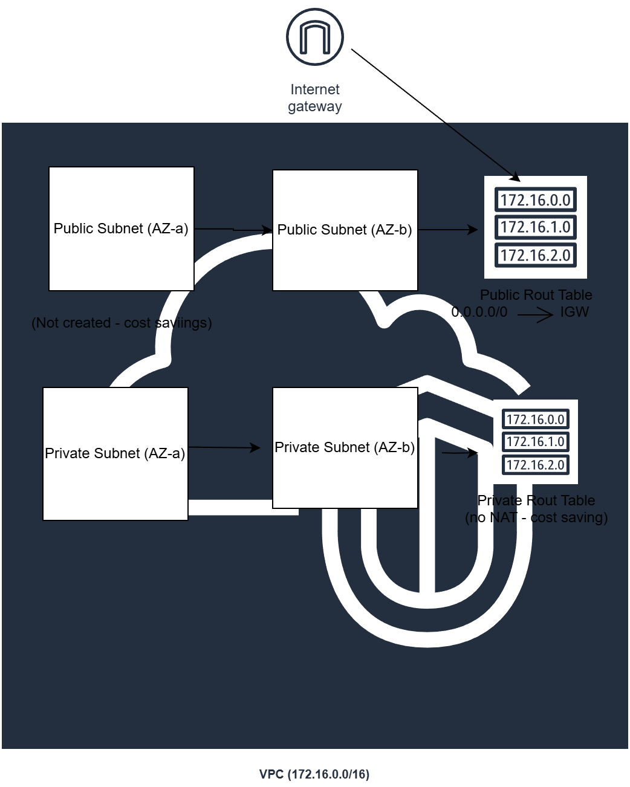

# Terraform AWS VPC Project (Public + Private Subnets)

This project provisions a **two-tier AWS VPC** in **us-east-1** using Terraform:
- **Public subnets** for internet-facing resources
- **Private subnets** for internal resources

✅ **Cost note:** NAT Gateway is intentionally **not created** to avoid hourly charges.  
Private subnets will not have outbound internet access unless you later add NAT (optional).

---

## Architecture

- **VPC:** `172.16.0.0/16`
- **2 Public Subnets** (multi-AZ)
- **2 Private Subnets** (multi-AZ)
- **Internet Gateway**
- **Public Route Table**
  - Route `0.0.0.0/0 → Internet Gateway`
- **Private Route Table**
  - No default route to NAT (cost-saving)

---

## What This Demonstrates (Skills)

- Terraform Infrastructure as Code (IaC)
- AWS VPC networking fundamentals (CIDR, subnets, route tables)
- Multi-AZ design
- Git & GitHub workflow
- Cost optimization awareness (avoiding NAT charges)

---

## Prerequisites

- Terraform installed
- AWS CLI installed
- An AWS profile configured (example: `terraform`)

Check your identity:
```bash
aws sts get-caller-identity --profile terraform
